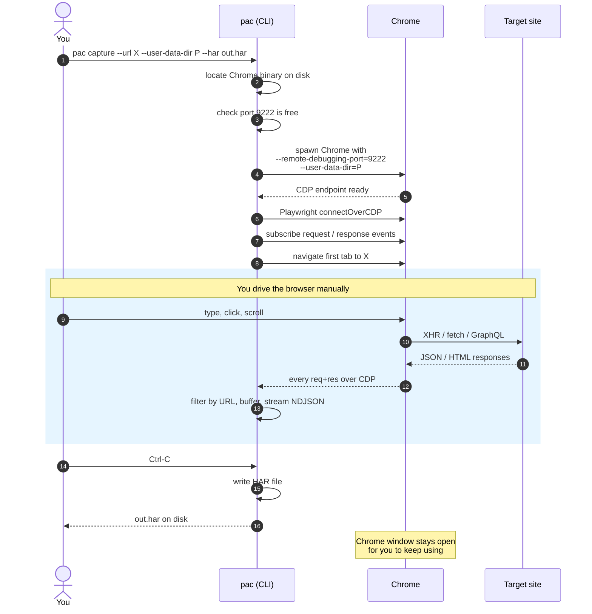
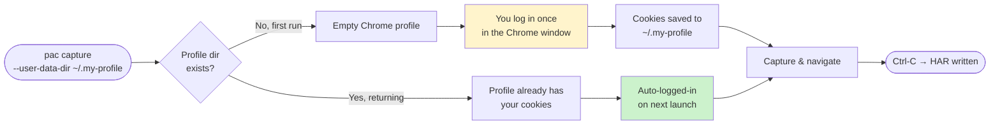
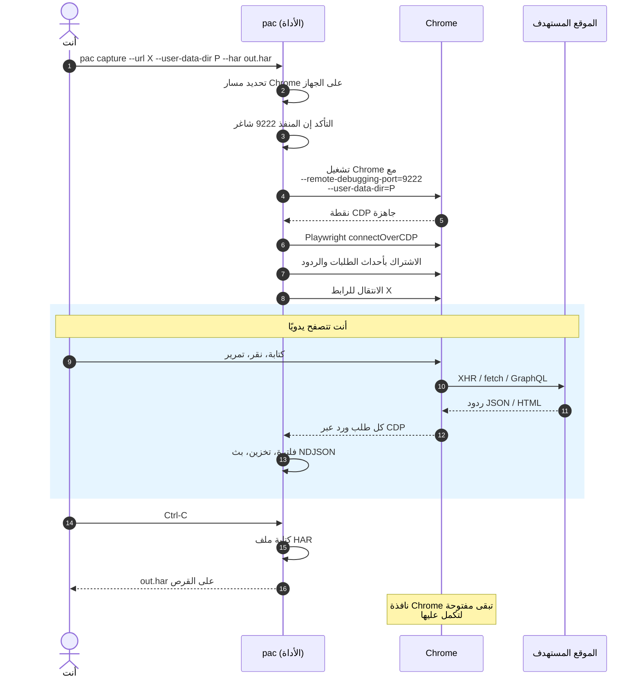
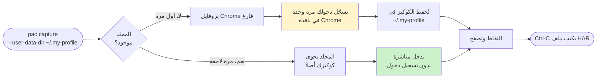

# playwright-attach-chrome

> Drive a **real Chrome window** with Playwright. Capture, filter, and export every network request the page makes — JSON / NDJSON / HAR. MIT.

[](https://www.npmjs.com/package/playwright-attach-chrome)
[](LICENSE)

[العربية ↓](#عربي)

---

## Why

Playwright normally launches its own ephemeral Chromium. That means **no cookies, no logins, no extensions** from your real browser. If you want to reverse-engineer an internal API of a SaaS you're already logged into, that's a hard wall.

This package launches Chrome with a **persistent user-data-dir** and **`--remote-debugging-port`**, then connects Playwright to it via CDP. You log in once, Chrome remembers you forever (the cookies live in the data dir), and Playwright sees every request the page makes.

Works on macOS, Linux, and Windows. Auto-detects Chrome / Chromium / Edge / Brave.

## Requirements

- **Chrome** (or Chromium / Edge / Brave) installed at a standard path — auto-detected on macOS, Linux, and Windows. Pass `--chrome-path` to override.
- **Node.js ≥ 18.**

That's it. **You do NOT need to install Playwright separately.** This package depends on [`playwright-core`](https://www.npmjs.com/package/playwright-core) — Playwright's API without bundled browsers — because we attach to your real Chrome instead of launching Playwright's bundled Chromium. No `npx playwright install`, no 300 MB browser download.

## How it works



### First run vs later runs

The CLI's secret weapon is the `--user-data-dir` flag — it points Chrome at a folder where it stores cookies, localStorage, extensions, history. Reuse the same folder across runs and your login persists.



## Install

```bash
npm install -g playwright-attach-chrome
# or run without install:
npx playwright-attach-chrome capture --url https://example.com
```

## Quick start — CLI

```bash
# Launch Chrome at a URL, capture every request, save to HAR:
pac capture \
  --url https://business.gathern.co \
  --filter api.gathern.co \
  --har gathern.har \
  --user-data-dir ~/.gathern-profile
```

You'll see Chrome open. **Log in once.** Click around. Every matching request is printed live:

```
→ GET    https://api.gathern.co/v1/business/chalet/list?access-token=...
← 200    https://api.gathern.co/v1/business/chalet/list?access-token=...
→ POST   https://api.gathern.co/v1/business/reservation/filter
← 200    https://api.gathern.co/v1/business/reservation/filter
```

Press Ctrl-C — `gathern.har` is written. Open it in Chrome DevTools (Network tab → drag-and-drop) or Postman / Insomnia.

Reuse the same `--user-data-dir` next time and you skip the login.

### CLI flags

| Flag | Description |
| --- | --- |
| `--url <url>` | URL to open in the first tab |
| `--filter <pattern>` | Substring (e.g. `api.gathern.co`) or `/regex/` (e.g. `/\\/api\\/v\\d/`) |
| `--har <path>` | Write a HAR 1.2 file on exit |
| `--ndjson <path>` | Stream every event as NDJSON (one JSON per line) |
| `--user-data-dir <path>` | Persistent profile dir. Reuse across runs to keep the login. |
| `--port <number>` | CDP port (default 9222) |
| `--chrome-path <path>` | Manual Chrome binary path |
| `--no-bodies` | Skip request/response bodies (saves memory) |
| `--max-body-bytes <n>` | Truncate bodies larger than n bytes (default 1 MB) |
| `--quiet` | Don't print the live log |

### Attach to an already-running Chrome

If you've already launched Chrome with `--remote-debugging-port=9222` yourself:

```bash
pac attach --port 9222 --filter api.gathern.co --har out.har
```

Useful when you want to debug a session that's already in progress without restarting Chrome.

## Quick start — MCP (drive it from an AI assistant)

The package ships an MCP server that lets Claude / Cursor / any MCP-aware tool drive the capture flow.

Register it in your MCP config (e.g. Claude Desktop's `~/Library/Application Support/Claude/claude_desktop_config.json` on macOS, or `~/.claude/mcp.json` for Claude Code):

```jsonc
{
  "mcpServers": {
    "playwright-attach-chrome": {
      "command": "npx",
      "args": ["-y", "playwright-attach-chrome", "mcp"]
    }
  }
}
```

Restart your assistant. Then ask:

> *Capture every api.gathern.co request while I log in and add a chalet, then summarise the endpoints.*

The assistant will:

1. Call **`start_capture`** with the URL + filter → Chrome window opens, you log in
2. Call **`peek_events`** as you interact → live view of captured calls
3. Call **`get_event`** for any request whose body it needs to inspect
4. Call **`stop_capture`** when you say done → returns a summary + writes a HAR

### MCP tool surface

| Tool | What it does |
| --- | --- |
| `start_capture` | Launch Chrome, attach Playwright, navigate, begin capture. Returns `sessionId`. |
| `peek_events` | Newest-first event summaries (filter / limit / direction). |
| `get_event` | Full headers + body for one event by index. Body cap configurable. |
| `navigate` | Programmatically drive the open tab to a new URL. |
| `stop_capture` | Stop, optionally write HAR, return summary (counts, top paths, status codes). |

## Quick start — library

```ts
import { launchChrome, attach, captureContext, writeHar } from 'playwright-attach-chrome';

const chrome = await launchChrome({
    startUrl: 'https://business.gathern.co',
    userDataDir: '/Users/me/.gathern-profile', // persistent: keep login
});

const { browser, defaultContext } = await attach({ cdpUrl: chrome.cdpUrl });

const capture = captureContext(defaultContext, {
    filter: 'api.gathern.co',
    onEvent: (e) => console.log(e.direction, e.method, e.url, e.status),
});

// ...let the user navigate, then:
process.on('SIGINT', async () => {
    await capture.stop();
    await writeHar(capture.events, 'gathern.har');
    await browser.close();
    process.exit(0);
});

await new Promise(() => {}); // park
```

## The trick (for anyone curious)

Chrome only allows DevTools Protocol attach on **a profile that was launched with the flag**. Your normal Chrome — the one with your real Gmail, Drive, banking tabs — is **not attachable**, on purpose: Chrome blocks it so a hostile script can't silently steal your cookies.

The workaround is a **parallel Chrome profile**:

```bash
"/Applications/Google Chrome.app/Contents/MacOS/Google Chrome" \
  --remote-debugging-port=9222 \
  --user-data-dir=$HOME/.my-capture-profile
```

That spawns a separate Chrome window with its own cookies, extensions, and bookmarks. You log in *there* once. Persisted. Playwright connects to that one.

This package wraps that ceremony so you can stop typing the flag soup.

## Caveats

- **Can't attach to your real Chrome.** That's a hard CDP rule, not a bug here.
- **First run = log in once.** After that, reuse the same `--user-data-dir` and you're in.
- **Bodies are stored in memory.** Long sessions on heavy sites can grow. Use `--max-body-bytes` or `--no-bodies`.
- **Cleanup is your call.** The CLI leaves the Chrome window open when you Ctrl-C, so you can keep using it. Quit Chrome manually when done.

## License

MIT.

---

<a id="عربي"></a>

# playwright-attach-chrome — العربية

> شغّل Playwright على نافذة Chrome حقيقية. التقط طلبات الشبكة وفلترها واحفظها بصيغة JSON / NDJSON / HAR.

## ليش

Playwright عادةً يفتح متصفح Chromium مؤقت بدون كوكيز ولا حسابك المسجّل. لو تبي تتجسس على API داخلي لخدمة أنت أصلًا داخل عليها (Gathern مثلًا)، هذا يقطع الطريق.

الأداة هذي تشغّل Chrome **بملف تعريف ثابت** على المنفذ ‎9222‎ (CDP)، ثم تربط Playwright عليه. تسجّل دخولك مرة وحدة، وChrome يحفظك للأبد (الكوكيز محفوظة في مجلد البروفايل)، وPlaywright يشوف كل طلب يطلع من الصفحة.

تدعم macOS و Linux و Windows. تكتشف Chrome / Chromium / Edge / Brave تلقائيًا.

## المتطلبات

- **Chrome** (أو Chromium / Edge / Brave) مثبّت بمكان قياسي — يكتشفه تلقائيًا. تقدر تمرر `--chrome-path` لو حاب تحدد مسار يدويًا.
- **Node.js ≥ 18.**

هذا كل شي. **مو لازم تثبّت Playwright بشكل منفصل.** الحزمة تعتمد على [`playwright-core`](https://www.npmjs.com/package/playwright-core) — يعني واجهة Playwright البرمجية فقط بدون متصفحات مرفقة — لأننا نربط على Chrome الحقيقي عندك بدل ما نشغّل Chromium الخاص بـ Playwright. ما تحتاج تنفّذ `npx playwright install` ولا تنزّل متصفح بحجم 300 ميقا.

## كيف تشتغل (شرح بصري)



### المرة الأولى مقابل المرات اللاحقة

سر الأداة هو `--user-data-dir` — مجلد يحتفظ Chrome فيه بالكوكيز و localStorage و الإضافات. استخدم نفس المجلد في كل مرة، ويبقى حسابك مسجّلًا.



## التثبيت

```bash
npm install -g playwright-attach-chrome
# أو بدون تثبيت:
npx playwright-attach-chrome capture --url https://example.com
```

## استعمال سريع — أوامر طرفية

```bash
pac capture \
  --url https://business.gathern.co \
  --filter api.gathern.co \
  --har gathern.har \
  --user-data-dir ~/.gathern-profile
```

يفتح Chrome. **سجّل دخولك مرة وحدة.** تجوّل في الموقع. كل طلب يطابق الفلتر يظهر في الطرفية مباشرة.

اضغط Ctrl-C — يُكتب ملف `gathern.har`. افتحه في Chrome DevTools (سحب وإفلات على لسان Network) أو في Postman / Insomnia.

استخدم نفس `--user-data-dir` في المرة الجاية تتفادى تسجيل الدخول.

## تشغيل سريع — MCP (من مساعد ذكي)

الحزمة تجي معاها MCP server يخلي Claude أو Cursor أو أي عميل MCP يقود عملية الالتقاط.

أضف الخادم في إعدادات MCP عندك (مثلًا `~/Library/Application Support/Claude/claude_desktop_config.json` على macOS، أو `~/.claude/mcp.json` لـ Claude Code):

```jsonc
{
  "mcpServers": {
    "playwright-attach-chrome": {
      "command": "npx",
      "args": ["-y", "playwright-attach-chrome", "mcp"]
    }
  }
}
```

أعد تشغيل المساعد، ثم اطلب منه:

> *التقط لي كل طلبات api.gathern.co وأنا أسجّل دخولي وأضيف شاليه، وبعدين لخّص لي نقاط الـ API.*

المساعد بيستخدم:

1. **`start_capture`** بالرابط + الفلتر → تنفتح نافذة Chrome، أنت تسجّل دخولك
2. **`peek_events`** أثناء استخدامك → عرض حي للطلبات الملتقطة
3. **`get_event`** لأي طلب يحتاج يقرأ محتواه الكامل
4. **`stop_capture`** لما تقول خلصت → يعطيك ملخص ويكتب HAR

### الأدوات (Tools) المعروضة

| Tool | الوظيفة |
| --- | --- |
| `start_capture` | تشغيل Chrome، ربط Playwright، فتح الرابط، بدء الالتقاط. ترجع `sessionId`. |
| `peek_events` | ملخص الطلبات من الأحدث (مع فلتر / عدد / اتجاه). |
| `get_event` | الترويسات والجسم كامل لطلب واحد. |
| `navigate` | فتح رابط جديد في نفس التبويب برمجيًا. |
| `stop_capture` | إيقاف، كتابة HAR اختياريًا، إرجاع ملخص (عدد، أكثر المسارات، رموز الحالة). |

## الحيلة (لو تحب تفهم)

Chrome يرفض الاتصال عبر DevTools Protocol على **بروفايلك الأصلي** — البروفايل اللي فيه جيميل والبنك وكل شي — أمنيًا، حتى لا يقدر سكربت خبيث يسرق كوكيزك بصمت.

الحل: **بروفايل Chrome موازي**:

```bash
"/Applications/Google Chrome.app/Contents/MacOS/Google Chrome" \
  --remote-debugging-port=9222 \
  --user-data-dir=$HOME/.my-capture-profile
```

نافذة Chrome ثانية، كوكيزها وحساباتها مستقلة. تسجّل دخولك فيها. وPlaywright يربط عليها.

الأداة هذي تختصر عليك كتابة هذا كله.

## ملاحظات مهمة

- **ما تقدر تربط على Chrome العادي** — قاعدة من Chrome نفسه، مو من الأداة.
- **سجّل دخولك أول مرة فقط** — أعد استخدام نفس `--user-data-dir` لاحقًا.
- **الأجسام (bodies) تتخزن في الذاكرة** — للجلسات الطويلة استخدم `--max-body-bytes` أو `--no-bodies`.
- **التنظيف عليك** — لما تضغط Ctrl-C، نافذة Chrome تبقى مفتوحة لتكمل عملك. اقفلها يدويًا.

## الترخيص

MIT.
